# Playsync: 홀덤 토너먼트의 온/오프라인 융합 관리 SaaS 시스템
> 오프라인 홀덤은 딜러의 실수, 플레이어의 턴 실수, 칩 계산 착오 등 실수가 빈번합니다.
> 이를 디지털로 풀어내어 실수를 줄이고 데이터정합성을 보장하고 본질에 집중할수 있는 시스템을 구축하고자 했습니다.

  
<h3>진행 상황</h3>

  3.15 MVP 개발완료, 1차 정리

---
## 🛠 기술 스택
- **Backend**: NestJS, WebSocket
  - 모듈 단위의 의존성 주입을 통해 로직을 구조화하고 유지보수성을 높였습니다.
  - WebSocket: 실시간 상태 공유를 통해 테이블/플레이어/토너먼트 진행을 동기화합니다.
- **Frontend**: Next.js
  - Server Action을 활용하여 httpOnly쿠키로 안전한 인증 로직을 구현하고 빠른 개발환경 구축을 위해 사용했습니다.
- **Database**: Redis, PostgreSQL
  - 수시로 변하는 게임 상태를 빠르게 읽고 쓰며, 서버는 웹소켓과 게임로직 처리를 담당시키기 위해 활용했습니다.
  - Redis Persistence(RDB/AOF)설정을 통해 토너먼트중 서버 장애시 플레이중인 핸드를 보장하고, 상태 복구를 보장합니다.
- **Auth**: JWT
  - 인증정보를 안전하게 처리하고 확장에도 유연하게 대응하기 위해 도입하였습니다.
- **ETC**: Prisma, Docker
  - Type-safe한 환경에서 개발 생산성과 안정성을 높이고, 초반 잦은 스키마 변경에 대응했습니다.
  - Docker: 추후 배포시 환경의 일관성을 유지하고, 개발환경을 빠르게 구축하기위해 사용했습니다.
---
## 🧐 겪었던 문제
- **Prisma 7.4 도입 및 트러블슈팅**
  - 라이브러리 사용법이 바뀌었고 AI가 제공해준 라이브러리 적용 코드들이 동작하지않아 공식문서를 찾아보며 해결했습니다.
  - https://docs.nestjs.com/recipes/prisma
- **인프라 보안 설정의 중요성 체감**
  - Docker 컨테이너 기반 Redis 사용 시, 바인딩 설정 미비로 인한 보안 취약점을 발견했습니다. 환경변수를 통한 인증(Requirepass) 설정으로 외부 접근을 차단하고 보안을 강화했습니다.
- **실시간 게임 로직의 테이블별 상태 정합성 보장**
  - 블라인드 레벨 상승 시 진행 중인 핸드에 즉시 영향을 주지 않도록, 각 테이블 세션별로 상태 스냅샷을 관리하여 핸드 종료 이후부터 적용되는 로직을 설계했습니다.
  - 블라인드 레벨 계산은 서버 타이머 대신 Lazy Update 방식을 적용하여 테이블 핸드 시작 시점에만 레벨을 계산하도록 했고, 이를 통해 서버가 대회 상태를 메모리에 보관하지 않는 stateless 구조를 유지했습니다.
  - 여러 테이블에서 동시에 블라인드 레벨 체크시 증가 연산이 아닌 블라인드 레벨 인덱스를 기준으로 갱신해 경쟁 상태에 강한 구조를 구현했습니다.
- **객체지향 원칙을 통한 물리 구조의 추상화**
  - 초기 설계 시 딜러와 물리 테이블이 로직들에 강하게 결합되어 확장성이 저해되는 문제를 겪었습니다. 이를 추상화된 개념으로 분리하여 물리적 환경에 구애받지 않는 유연한 구조를 구축했습니다.
---
## 🎉 프로젝트 성과 및 목적
- 현재 개발지식으로 최선의 구조를 만들어 보고자 사용자수가 많을것으로 가정한 프로젝트를 진행했습니다.
  - 기존에 진행했었던 CRUD위주의 프로젝트와 달리 Redis/DB의 역할을 분리해서 서버는 로직처리만 담당하는 구조를 설계해 보았습니다.
  - 결과 정산 시점에만 DB 트랜잭션을 실행하는 Write-back 패턴을 적용하여, DB I/O 부하를 기존 방식 대비 **90% 이상** 절감했습니다.
  - 10초의 액션 주기를 가진 환경에서 Render무료 인스턴스 기준 약 **CCU 800명** 규모를 안정적으로 수용가능을 확인했습니다.

---
## 🚀 향후 확장
- 토너먼트의 과거 정보등 가맹점별 상세조회, 관리페이지
- 결제연동을 통한 대회에 참여할수 있는 포인트 추가기능
- 좌석 결정시 웹소켓을 통한 실시간 자리 선점정보
- 리바이 콜백(구현완료)을 웹소켓과 연결하여 리바인기능
- 테이블 밸런싱
- (관리페이지)서버 다운 복구시 블라인드 미루는 로직추가 (startedAt)
- 사용자 친화적인 UI
- 플랫폼 어드민 기능
- GraphQL 적용
---

  
<h2>🔥 핵심 로직</h3>

  
  
첫 레이즈 이후 더 큰 벳이 나오면 새로운 액션기회를 가집니다.

  
  
레이즈, 올인, 폴드 일때 액션 가능한 플레이어가 없으므로 쇼다운페이즈로 진입합니다.

  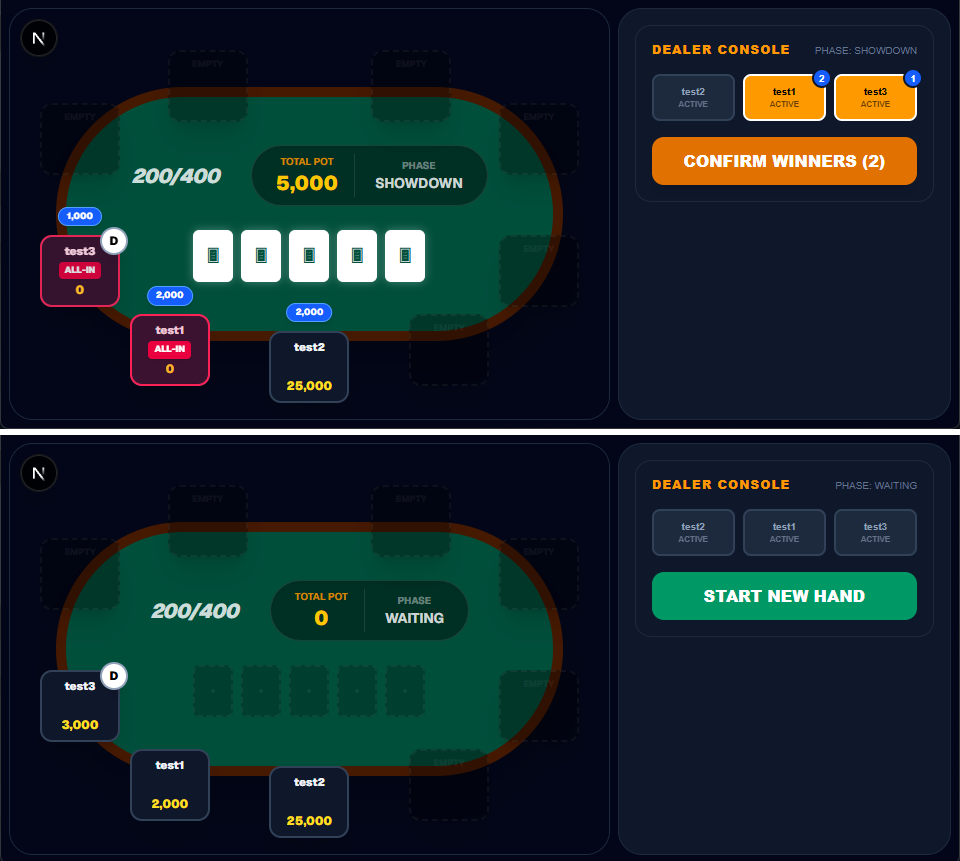
  
딜러콘솔에서 클릭한 순서대로 핸드가 강한순입니다.

  
1000을 베팅한 test3 3000, test2 보다 test1이 높은패 인 상황에 test1이 나머지팟을 가져갑니다

  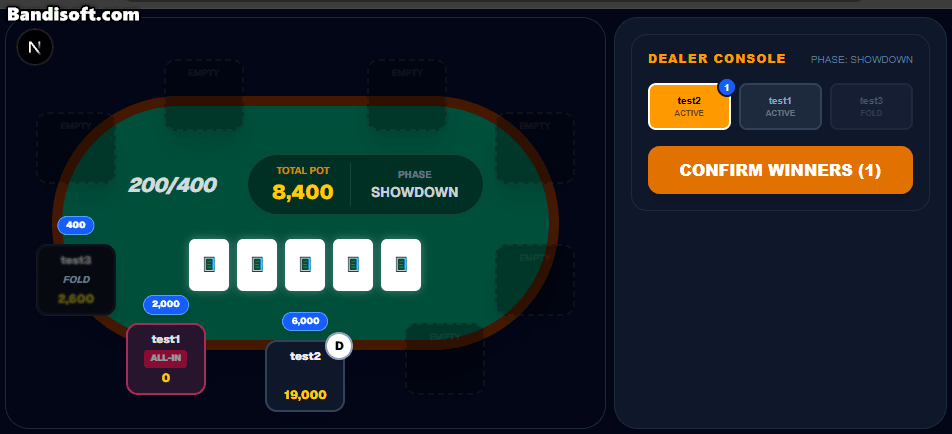
  
딜러가 승자결정시 상태수정, 0인 플레이어 탈락처리, 상태 기준으로 db업데이트, 0인플레이어를 상태에서 제거합니다.

  
<h3>🗺️ 설계 전체</h3>

  

    
<h3>아키텍쳐</h3>

    
  

  

    
<h3>플로우 차트</h3>

    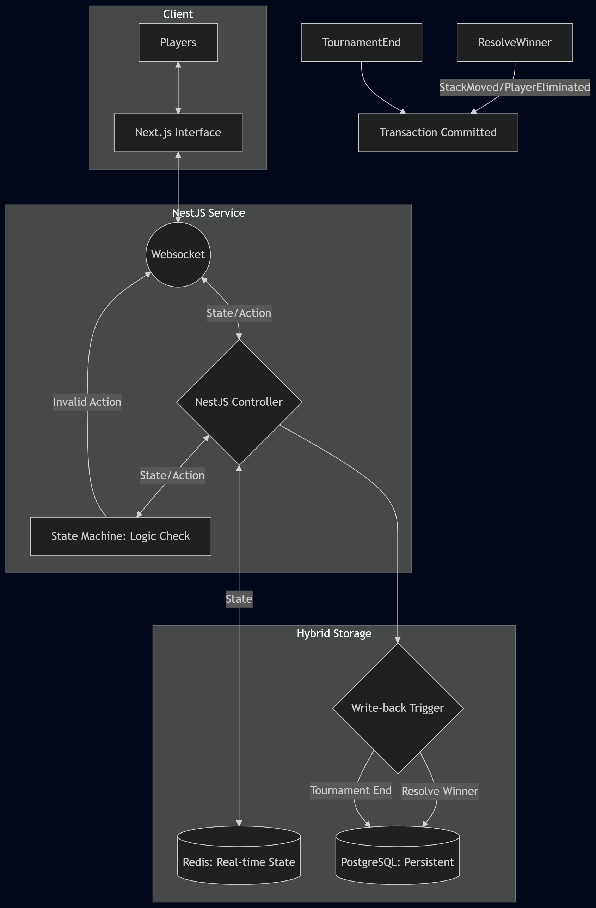
  

## 📌 사용 흐름

  
<h3>🎉 토너먼트 생성</h3>

  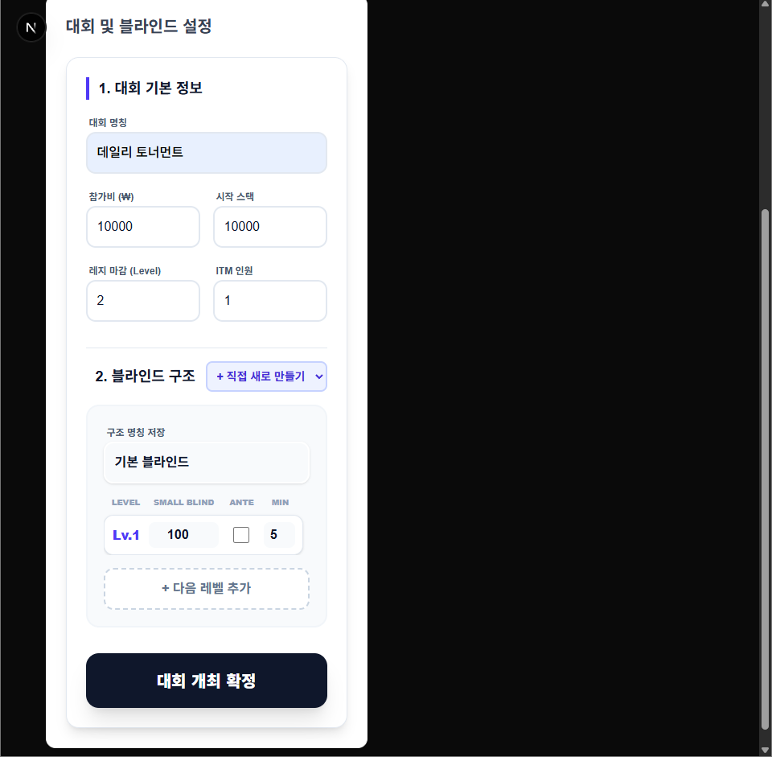
  
상점 관리페이지에서 토너먼트 생성 시 블라인드 구조를 새로 등록가능합니다.

  
  
기존의 블라인드를 설정해두었다면 재사용 가능합니다.

  
<h3>🥷 딜러 인증</h3>

  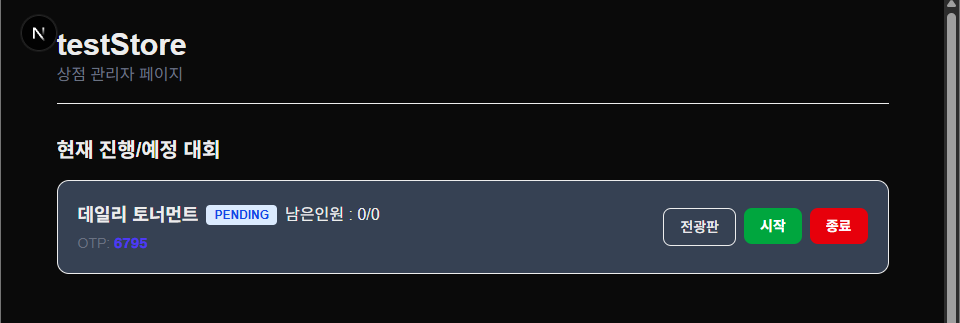
  
토너먼트가 생성되면 딜러 OTP가 발급됩니다.

  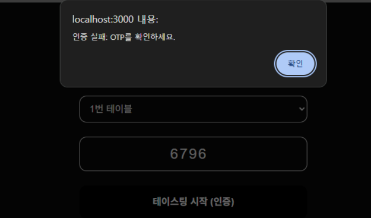
  
OTP 검증 화면입니다.

  
  
OTP 검증 화면입니다.

  
<h3>🙋‍♂️ 유저 착석</h3>

  
  
유저는 원하는 자리에 앉을 수 있습니다.

  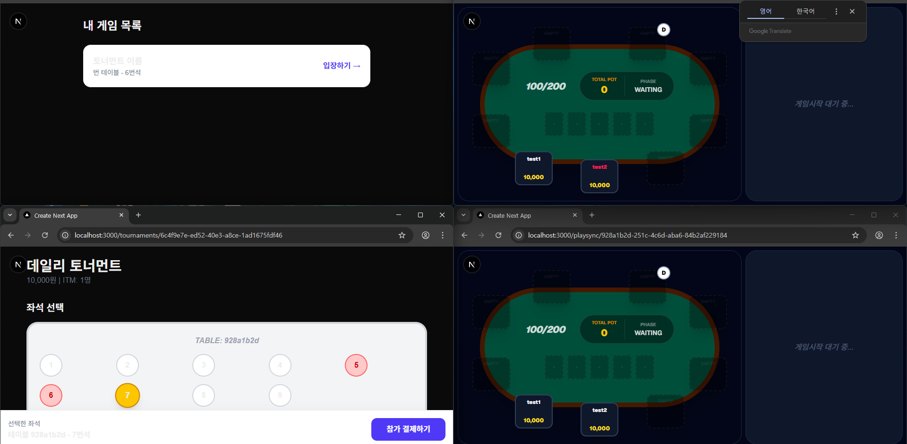
  
우측 하단은 딜러화면이고,다른 플레이어가 이미 결제한 자리는 빨간색으로 표시됩니다.

  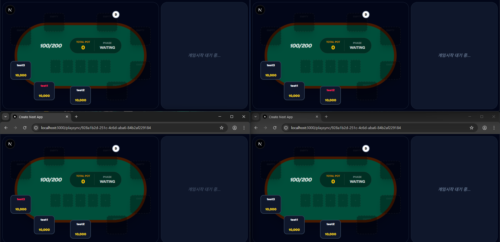
  
모든 플레이어가 웹소켓으로 접속해있는 화면입니다.

  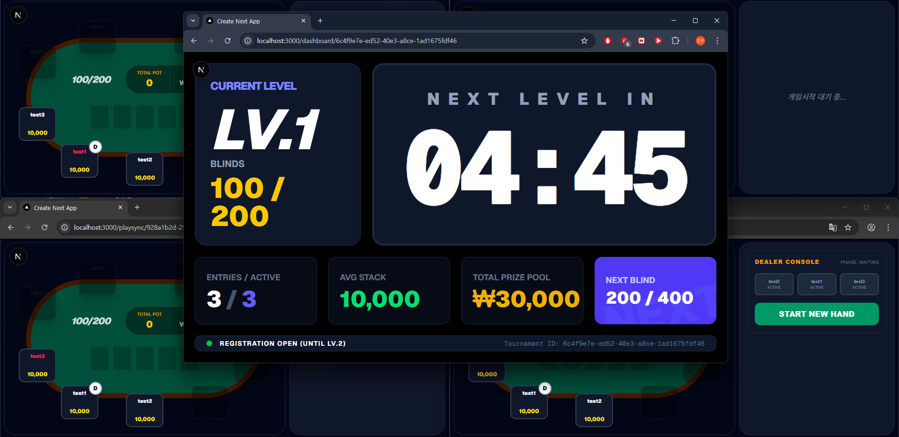
  
관리페이지에서 대회를 시작하면 해당 대회정보를 Redis에 올리게됩니다.

  
<h3>⌨️ 상태머신을 통한 실시간 화면</h3>

  
  
첫 레이즈 이후 더 큰 벳이 나오면 새로운 액션기회를 가집니다.

  
  
test1 플레이어가 30초 이내로 액션을 하지않았습니다.

  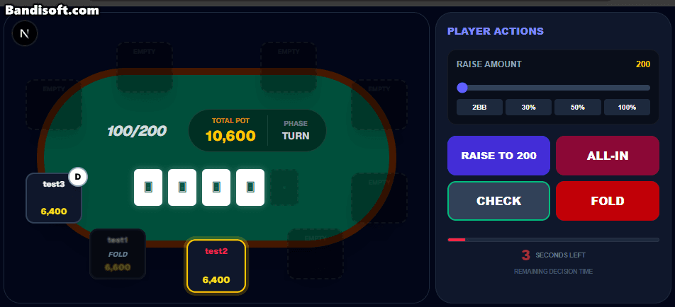
  
test2 플레이어가 30초 이내로 액션을 하지않았고, 콜 할 금액이 없어 자동으로 체크.

  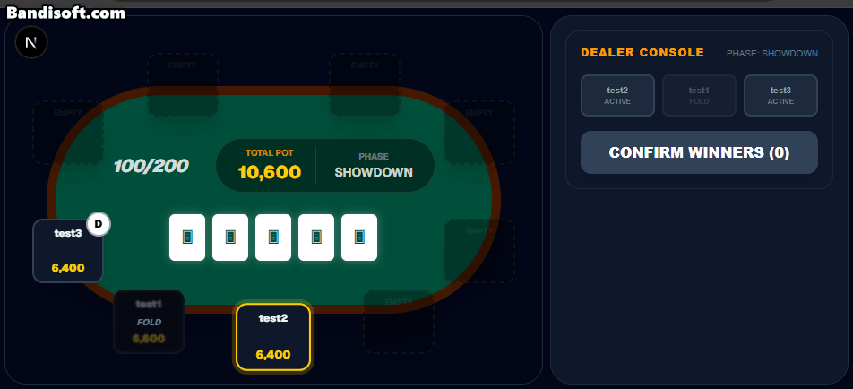
  
딜러가 test2 플레이어에게 승리를 선언합니다.

  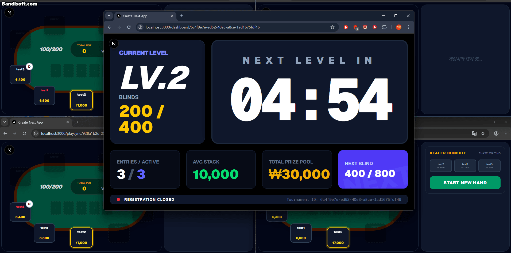
  
테이블별 블라인드는 핸드 시작 시점에 업데이트됩니다.

  
  
사이드팟이 생기는 상황입니다. test2 플레이어가 콜할 금액이 높아져 액션을 더 진행했습니다.

  
  
딜러콘솔에서 클릭한 순서대로 핸드가 강한순입니다.

  
1000을 베팅한 test3 3000, test2 보다 test1이 높은패 인 상황에 test1이 나머지팟을 가져갑니다

  
  
레이즈, 올인, 폴드 일때 액션 가능한 플레이어가 없으므로 쇼다운페이즈로 진입합니다.

  
  
딜러가 승자결정시 상태수정, 0인 플레이어 탈락처리, 상태 기준으로 db업데이트, 0인플레이어를 상태에서 제거합니다.

  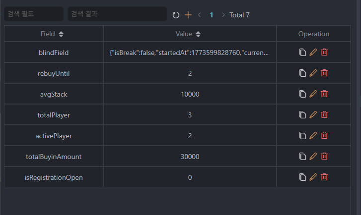
  
Redis에도 업데이트가 된 모습입니다.

---
